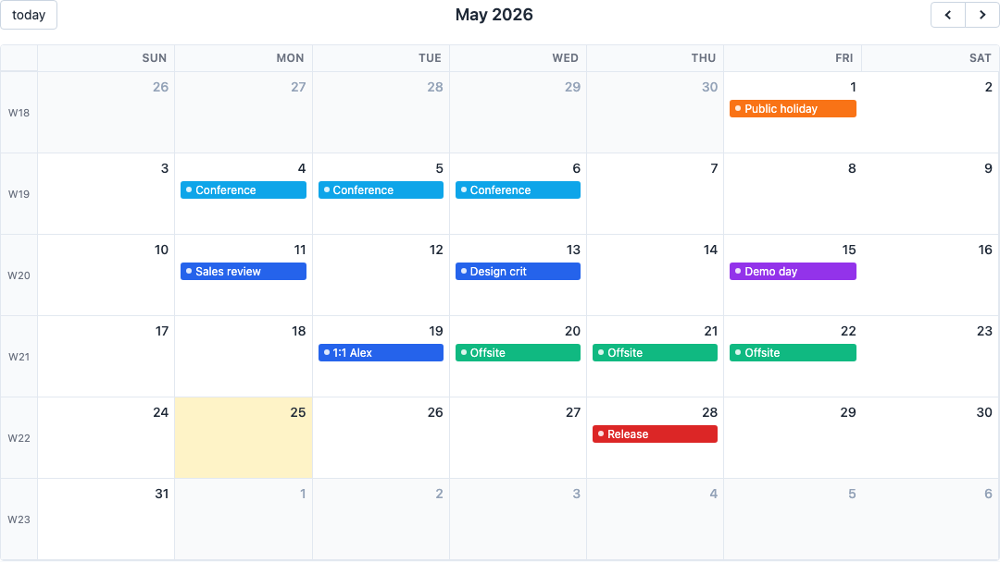
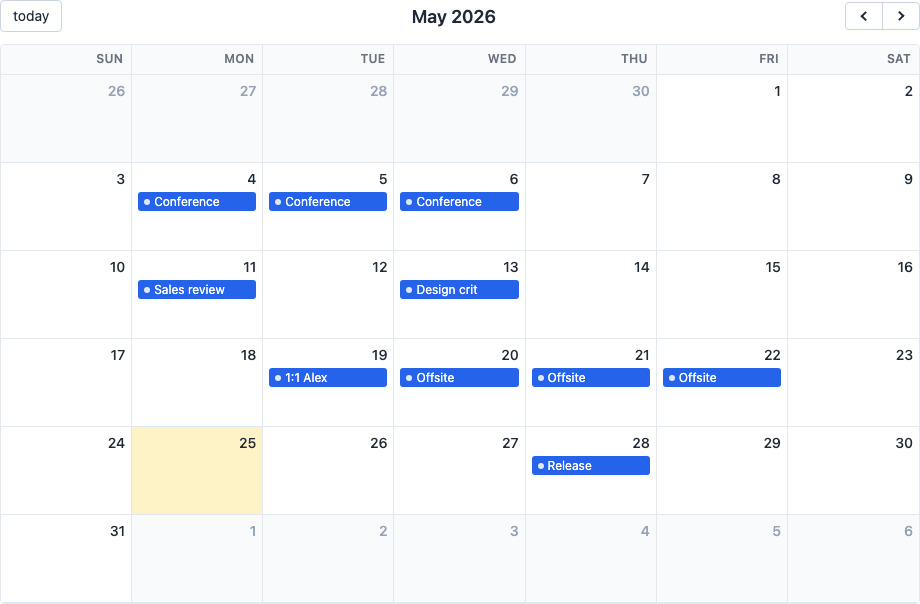
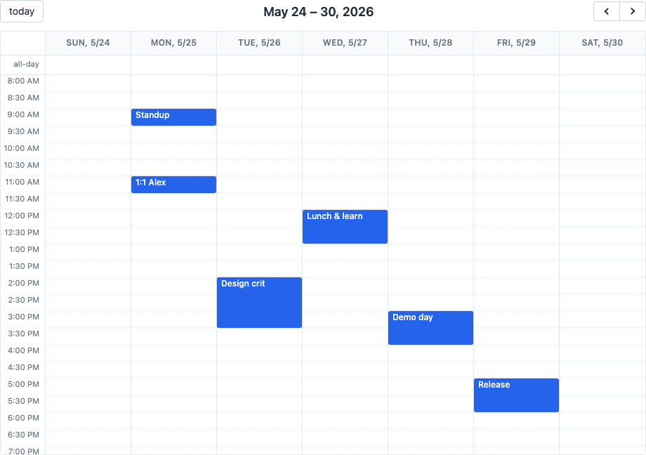
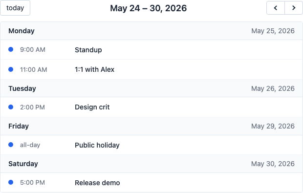
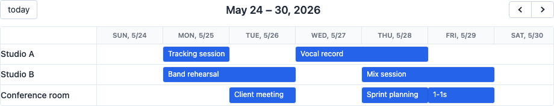
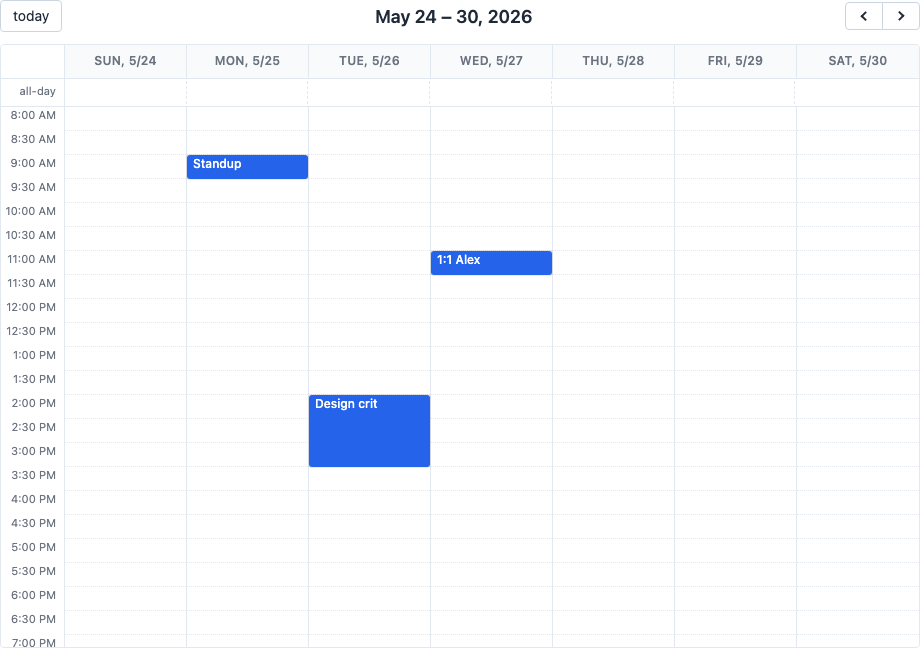
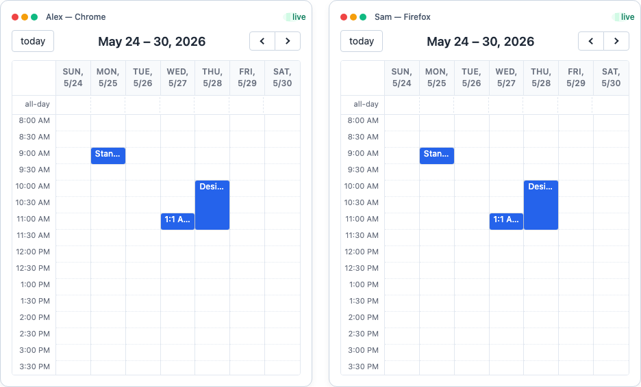

# stimulus_calendar

[](https://github.com/schappim/stimulus_calendar/actions/workflows/ci.yml)
[](https://www.npmjs.com/package/@ninjaai/stimulus_calendar)
[](https://rubygems.org/gems/stimulus_calendar_rails)

A full-sized, **HTML-first event calendar for [Stimulus.js](https://stimulus.hotwired.dev/) (Hotwire)** — month, week, day, list, resource and timeline views, drag &amp; drop, resource scheduling, and **live multi-user sync over Turbo Streams**. Drop `data-controller="calendar"` on a `<div>`, describe the calendar with `data-*` attributes, and you get a working calendar — no React, no build-time options object, no third-party scheduling framework. With the optional [`stimulus_calendar_rails`](gem/stimulus_calendar_rails) companion, every drag, resize or edit also **streams live to every connected client over Turbo Streams** (Action Cable) — optimistic updates, server-side validation, and tenant-scoped broadcasts included.

A 100% Stimulus port of [vkurko/calendar](https://github.com/vkurko/calendar) (Svelte 5; v5.7.1). Inspired by [FullCalendar](https://fullcalendar.io/).



> Prefer the Rails/Hotwire server-driven version — live multi-user editing
> over Turbo Streams, server-side event sources, optimistic updates, and
> drag/drop persistence? It ships as the **`stimulus_calendar_rails`** gem;
> see the **Rails & Hotwire** section below,
> [`gem/stimulus_calendar_rails`](gem/stimulus_calendar_rails), and
> [`RAILS.md`](RAILS.md). LLM usage docs live in [`skills/`](skills).

## Status

🚧 **Early — migration in progress.** See [PLAN.md](./PLAN.md) for the
per-feature checklist. Each unchecked box is a planned commit, shipped with
tests, a demo, a screenshot, and (where Rails-touching) a matching
`gem/demo/test/` case run against a real Rails app.

---

## Install

**Option A — plain `<script>` (no bundler).** Self-contained IIFE bundle with
Stimulus included; works over `file://`, a static server, anything. Vendor the
files from `dist/`, or load them from a CDN:

```html
<link rel="stylesheet" href="https://unpkg.com/@ninjaai/stimulus_calendar/dist/stimulus_calendar.css" />
<script src="https://unpkg.com/@ninjaai/stimulus_calendar/dist/stimulus_calendar.js"></script>
<script> StimulusCalendar.start() </script>
```

**Option B — npm + a bundler (Vite, esbuild, webpack…).** Stimulus is a peer
dependency, so install it alongside:

```bash
npm install @ninjaai/stimulus_calendar @hotwired/stimulus
```

```js
import { Application } from "@hotwired/stimulus"
import StimulusCalendar from "@ninjaai/stimulus_calendar"   // resolves to dist/stimulus_calendar.esm.js
import "@ninjaai/stimulus_calendar/style.css"

const app = Application.start()
StimulusCalendar.start(app)                  // registers calendar (+ later: header-toolbar, day-cell, …)
```

`StimulusCalendar.start(app?)` registers all controllers on the given Stimulus
`Application` (or starts a new one) and returns it.

**Option C — Rails / Hotwire (gem from RubyGems).** The
[`stimulus_calendar_rails`](https://rubygems.org/gems/stimulus_calendar_rails)
gem bundles this calendar *and* the live-sync layer, importmap-pinned — no JS
build, no `dist/` to vendor:

```bash
bundle add stimulus_calendar_rails
```

Full setup (importmap, stylesheet, routes, optional migration) is in the
**Rails & Hotwire** section below.

**Option D — clone the repo and run it locally.** Useful for following along
with the port or sending a PR:

```bash
git clone git@github.com:schappim/stimulus_calendar.git
cd stimulus_calendar
npm install
npm run dev                     # open http://localhost:5173/demo/
npm test                        # JS test suite (Vitest)
npm run build:lib               # build dist/stimulus_calendar.js + .esm.js + .css

# Rails companion (once Phase 14 has shipped):
cd gem/demo
bundle install
bin/rails db:setup
bin/rails server                # open http://localhost:3000/calendars
bin/rails test                  # Rails integration tests
```

## Quick start

```html
<link rel="stylesheet" href="dist/stimulus_calendar.css" />

<div data-controller="calendar"
     data-calendar-view-value="timeGridWeek"
     data-calendar-plugins-value='["TimeGrid", "Interaction"]'
     data-calendar-options-value='{
       "events": [
         { "id": "1", "title": "Standup",     "start": "2026-05-25T09:00", "end": "2026-05-25T09:30" },
         { "id": "2", "title": "Design crit", "start": "2026-05-26T14:00", "end": "2026-05-26T15:00" }
       ]
     }'
     style="height: 600px"></div>

<script src="dist/stimulus_calendar.js"></script>
<script>StimulusCalendar.start()</script>
```

Events can be **server-rendered** (passed via `data-calendar-options-value` JSON),
loaded from a **URL** (`data-calendar-event-source-value="/events.json"`), or
mutated in JS via `element.calendarApi.addEvent({…})`.

## Screenshots

> Images land here as each feature ships — see [PLAN.md](./PLAN.md). The
> filenames below are the canonical targets; the dev server + Rails dummy
> app are what they're captured from.

**Month view** — multi-day events span weeks, today is highlighted, week
numbers in the left gutter.



**Week view (TimeGrid)** — sidebar of time slots + day columns, all-day row
across the top, now indicator drawn live.



**List view** — chronological list of events grouped by day.



**Resource timeline** — vertical resource axis + horizontal time axis, with
nested expandable resources.



**Drag, drop &amp; resize** — pointer-driven edits. With the Rails gem, each
drag PATCHes the server and broadcasts the new times to every other tab.



**Live multi-user sync** — Turbo Streams: one user moves an event, every other
connected user sees it move within ~50ms.



## Calendar attributes (`data-calendar-*-value`)

Pass any option as a `data-calendar-<option>-value` attribute (kebab-case),
or bundle several together under `data-calendar-options-value` as a JSON
object. Both forms are equivalent — pick whichever is convenient. Object /
array values must be JSON-encoded; scalars stay literal.

Every option below is built in — there is **no external options reference
to consult**. Items ship as their matching [PLAN.md](./PLAN.md) checkbox
ticks; unticked options accept the value and ignore it for now.

### Core (every view) — 41 options

| Option | Type | Default | What it does |
|---|---|---|---|
| `view` | string | (from plugin) | Initial view name (see the per-plugin tables below for the full list). |
| `views` | object | `{}` | Per-view overrides keyed by view name (e.g. `{ "timeGridWeek": { slotDuration: "00:15" } }`). |
| `plugins` | string[] | `[]` | Which plugins to load: `"DayGrid"`, `"TimeGrid"`, `"List"`, `"Resource"`, `"ResourceTimeGrid"`, `"ResourceTimeline"`, `"Interaction"`. |
| `date` | Date \| ISO string | `today` | The date the calendar is anchored at; navigates around this point. |
| `duration` | Duration | `{ weeks: 1 }` | How much time a view spans (`{days: 1}`, `"01:00"`, `90`s, etc.). |
| `dateIncrement` | Duration | `duration` | Step size for prev/next buttons. |
| `firstDay` | 0–6 | `0` (Sun) | First day of the week. |
| `hiddenDays` | number[] | `[]` | Weekdays to hide (`[0, 6]` → weekends). |
| `validRange` | `{ start, end }` | `undefined` | Restrict navigation to this window; outside dates render disabled. |
| `height` | string \| number | `undefined` | CSS height for the calendar shell. |
| `theme` | object | (see `src/lib/theme.js`) | Map of CSS class names; pass a function `(prev) => merged` to extend. |
| `locale` | string \| object | `undefined` | `Intl` locale tag (e.g. `"fr-FR"`) or full locale object. |
| `timeZone` | string | `"local"` | `"local"`, `"UTC"`, or a named IANA TZ (e.g. `"Australia/Sydney"`). |
| `customScrollbars` | bool | `false` | Render the calendar's own scrollbars instead of the browser's. |
| `viewDidMount` | fn(`{view, el}`) | `undefined` | Fires when a view is first rendered. |
| `datesSet` | fn(`{start, end, view}`) | `undefined` | Fires when the displayed range changes. |
| `loading` | fn(isLoading) | `undefined` | Fires when an event source starts/stops fetching. |
| `lazyFetching` | bool | `true` | Re-hit event source URLs only when the view range changes. |
| `highlightedDates` | (Date\|string)[] | `[]` | Dates to render with the highlight theme. |
| `titleFormat` | Intl format | `{ year:'numeric', month:'short', day:'numeric' }` | Toolbar title format. |
| `dayHeaderFormat` | Intl format | `{ weekday:'short', month:'numeric', day:'numeric' }` | Column-header format. |
| `dayHeaderAriaLabelFormat` | Intl format | `{ dateStyle: 'full' }` | Screen-reader header text. |
| `icons` | object | `{}` | Map of icon name → `{ html }` or string; passing a function `(prev) => merged` extends. |
| `buttonText` | object | (see below) | Map of button name → label; same merge semantics as `theme`. |
| `customButtons` | object | `{}` | `{ name: { text, click, … } }` toolbar buttons. |
| `headerToolbar` | `{ start, center, end }` | `{ start:'title', center:'', end:'today prev,next' }` | Toolbar layout; tokens: `title`, `today`, `prev`, `next`, `prevYear`, `nextYear`, any view name, or a custom-button name. Use a space (`prev,next`) for a button group. |
| `events` | Event[] | `[]` | Inline event array. |
| `eventSources` | EventSource[] | `[]` | Array of `{ events, url, color, classNames, ... }` sources (function sources OK). |
| `eventFilter` | fn(event) → bool | `undefined` | Per-event include/exclude predicate. |
| `eventOrder` | string \| string[] \| fn | `undefined` | Sort key(s) within a slot. |
| `eventColor` | string | `undefined` | Shorthand setting bg + text. |
| `eventBackgroundColor` | string | `undefined` | Per-event default; per-event `backgroundColor` wins. |
| `eventTextColor` | string | `undefined` | Per-event default; per-event `textColor` wins. |
| `eventClassNames` | string \| string[] \| fn | `undefined` | Extra classes on every event element. |
| `eventContent` | fn(info) \| `{ html }` \| `{ domNodes }` \| string | `undefined` | Replace the default event renderer. |
| `eventDidMount` | fn(`{event, el, view}`) | `undefined` | Fires once each event is in the DOM. |
| `eventTimeFormat` | Intl format | `{ hour:'numeric', minute:'2-digit' }` | Time text shown on each event. |
| `displayEventEnd` | bool | `true` | Show end-time text on events. |
| `eventClick` | fn(`{event, jsEvent}`) | `undefined` | Click handler. |
| `eventMouseEnter` | fn(`{event, jsEvent}`) | `undefined` | Hover-in handler. |
| `eventMouseLeave` | fn(`{event, jsEvent}`) | `undefined` | Hover-out handler. |
| `eventAllUpdated` | fn() | `undefined` | Fires after every event re-render pass. |
| `selectable` | bool | `false` | Allow dragging across cells to select a range (Interaction plugin). |

### DayGrid plugin — adds the `dayGridDay`, `dayGridWeek`, `dayGridMonth` views

| Option | Type | Default | What it does |
|---|---|---|---|
| `dayCellFormat` | Intl format | `{ day:'numeric' }` | Day-number format inside each cell. |
| `dayCellContent` | fn(info) \| string \| `{ html }` | `undefined` | Replace the day-cell's body content. |
| `dayMaxEvents` | bool \| number | `false` | Collapse overflow into a "+N more" link; `true` = auto-fit. |
| `moreLinkContent` | fn(info) \| string | `undefined` | Replace the "+N more" link content. |
| `dayPopoverFormat` | Intl format | `{ month:'long', day:'numeric', year:'numeric' }` | Header format for the day popover. |
| `weekNumbers` | bool | `false` | Render an ISO/Western week-number column. |
| `weekNumberContent` | fn(`{week, date}`) \| string | `undefined` | Replace the week-number cell content. |

Adds toolbar buttons `dayGridDay` / `dayGridWeek` / `dayGridMonth` (+ `close`).

### TimeGrid plugin — adds the `timeGridDay`, `timeGridWeek` views

| Option | Type | Default | What it does |
|---|---|---|---|
| `slotDuration` | Duration | `"00:30:00"` | Length of each row slot. |
| `slotHeight` | number (px) | `24` | Pixel height per slot. |
| `slotMinTime` | Duration | `"00:00:00"` | First visible time-of-day. |
| `slotMaxTime` | Duration | `"24:00:00"` | Last visible time-of-day. |
| `slotLabelInterval` | Duration | `undefined` | Time-axis label cadence (defaults to `slotDuration`). |
| `slotLabelFormat` | Intl format | `{ hour:'numeric', minute:'2-digit' }` | Time-axis label format. |
| `scrollTime` | Duration | `"06:00:00"` | Initial scroll position. |
| `flexibleSlotTimeLimits` | bool \| object | `false` | Auto-expand min/max when events spill outside. |
| `nowIndicator` | bool | `false` | Draw the "now" red line. |
| `slotEventOverlap` | bool | `true` | Render concurrent events overlapping (vs side-by-side). |
| `allDaySlot` | bool | `true` | Show the all-day row. |
| `allDayContent` | fn \| string \| `{html}` | `undefined` | Replace the all-day label. |
| `columnWidth` | number (px) | `undefined` | Force a fixed day-column width (else auto-fits). |
| `snapDuration` | Duration | `undefined` | Drag/resize/select grid resolution; falls back to `slotDuration`. |

Adds toolbar buttons `timeGridDay` / `timeGridWeek`.

### List plugin — adds the `listDay`, `listWeek`, `listMonth`, `listYear` views

| Option | Type | Default | What it does |
|---|---|---|---|
| `listDayFormat` | Intl format | `{ weekday: 'long' }` | Day-header (left side) format. |
| `listDaySideFormat` | Intl format | `{ year:'numeric', month:'long', day:'numeric' }` | Day-header (right side) format. |
| `noEventsContent` | string \| fn \| `{html}` | `"No events"` | Empty-state body. |
| `noEventsClick` | fn(`{jsEvent}`) | `undefined` | Click handler on the empty-state. |

Adds toolbar buttons `listDay` / `listWeek` / `listMonth` / `listYear`.

### Resource + ResourceTimeGrid plugin — adds `resourceTimeGridDay`, `resourceTimeGridWeek`

| Option | Type | Default | What it does |
|---|---|---|---|
| `resources` | Resource[] \| fn \| EventSource-shape | `[]` | Resource axis: array of `{ id, title, eventBackgroundColor?, eventTextColor?, children? }`. |
| `refetchResourcesOnNavigate` | bool | `false` | Re-fetch a function/URL resource source on prev/next. |
| `datesAboveResources` | bool | `false` | Swap the axes — dates on top, resources on left, or vice versa. |
| `resourceLabelContent` | fn(`{resource}`) \| string | `undefined` | Replace the resource-label content. |
| `resourceLabelDidMount` | fn(`{resource, el}`) | `undefined` | Fires once each resource label is in the DOM. |
| `filterResourcesWithEvents` | bool | `false` | Hide resources with zero events in the active range. |
| `filterEventsWithResources` | bool | `false` | Hide events whose `resourceIds` don't match any visible resource. |

Inherits every TimeGrid option (slots, all-day, now indicator). Adds toolbar
buttons `resourceTimeGridDay` / `resourceTimeGridWeek`.

### ResourceTimeline plugin — adds `resourceTimelineDay/Week/Month/Year`

| Option | Type | Default | What it does |
|---|---|---|---|
| `slotWidth` | number (px) | `32` | Width of each time-axis cell. |
| `monthHeaderFormat` | Intl format | `{ month: 'long' }` | Header format for month/year timeline views. |
| `resourceExpand` | bool \| `'all'` \| number | `undefined` | Auto-expand resource tree to depth N (use `'all'` for everything). |

Inherits every TimeGrid (slots / now indicator) and Resource (filter / label
hooks) option. Adds toolbar buttons `resourceTimelineDay/Week/Month/Year`
and `expand` / `collapse`.

### Interaction plugin — drag, drop, resize, click-to-select

| Option | Type | Default | What it does |
|---|---|---|---|
| `pointer` | bool | `false` | Enable pointer affordances (cursor changes, hover preview). |
| `dateClick` | fn(`{date, allDay, jsEvent}`) | `undefined` | Click handler on an empty cell. |
| `editable` | bool | `false` | Master switch — enables drag/resize on every event. |
| `eventStartEditable` | bool | `true` | When `editable`, allow start-time edits. |
| `eventDurationEditable` | bool | `true` | When `editable`, allow duration edits via resize. |
| `eventResizableFromStart` | bool | `false` | Render a resize handle on the leading edge too. |
| `eventDragStart` | fn(info) | `undefined` | Fires when a drag begins. |
| `eventDragStop` | fn(info) | `undefined` | Fires when a drag ends (before drop). |
| `eventDrop` | fn(`{event, oldEvent, delta, revert}`) | `undefined` | Fires on drop — call `revert()` to undo. |
| `eventResizeStart` | fn(info) | `undefined` | Fires when a resize begins. |
| `eventResizeStop` | fn(info) | `undefined` | Fires when a resize ends (before commit). |
| `eventResize` | fn(`{event, oldEvent, endDelta, revert}`) | `undefined` | Fires on commit — call `revert()` to undo. |
| `eventDragMinDistance` | number (px) | `5` | Pointer-move threshold before a drag starts. |
| `eventLongPressDelay` | number (ms) | `undefined` | Override the global long-press for events. |
| `dragConstraint` | object | `undefined` | Restrict drag destinations (e.g. `{ resources: ['1', '2'] }`). |
| `dragScroll` | bool | `true` | Auto-scroll while dragging near an edge. |
| `snapDuration` | Duration | `undefined` | Grid resolution for drag/resize/select. |
| `resizeConstraint` | object | `undefined` | Restrict resize bounds. |
| `selectable` | bool | `false` | Allow click-drag selection across cells. |
| `select` | fn(`{start, end, allDay, jsEvent}`) | `undefined` | Fires on a selection. |
| `unselect` | fn(`{jsEvent}`) | `undefined` | Fires when the selection clears. |
| `unselectAuto` | bool | `true` | Clear selection on outside-click. |
| `unselectCancel` | string | `""` | CSS selector for elements that *don't* clear the selection. |
| `selectBackgroundColor` | string | `undefined` | Override the selection highlight colour. |
| `selectConstraint` | object | `undefined` | Restrict the bounds of a selection. |
| `selectMinDistance` | number (px) | `5` | Pointer-move threshold before a selection starts. |
| `selectLongPressDelay` | number (ms) | `undefined` | Override the global long-press for selections. |
| `longPressDelay` | number (ms) | `1000` | Touch long-press threshold for any pointer interaction. |

### stimulus_calendar extensions (not in any upstream calendar library)

| Attribute | Type | Default | What it does |
|---|---|---|---|
| `data-calendar-event-source-value` | URL string | `undefined` | Convenience for an URL event source — equivalent to `eventSources: [{ url }]`. |
| `data-calendar-resource-source-value` | URL string | `undefined` | Same idea for resources. |
| `data-calendar-broadcast-value` | string | `false` | Broadcast adapter: `"turbo-stream"`, `"action-cable"`, `"websocket"`, `"broadcast-channel"`, or `false` to disable. |
| `data-calendar-broadcast-channel-value` | string | `undefined` | Channel name (BroadcastChannel) or URL (WebSocket / ActionCable). |
| `data-calendar-broadcast-filter-value` | fn (set via `setOption`) | `undefined` | Predicate that decides which local mutations broadcast. |

### Built-in event shape (for `events` / `eventSources`)

| Key | Type | Notes |
|---|---|---|
| `id` | string | Required for any event you'll later update or remove. |
| `resourceIds` | string[] | Used by the Resource views. |
| `allDay` | bool | If omitted, inferred from `noTimePart(start)`. |
| `start` | Date \| ISO string | Required. |
| `end` | Date \| ISO string | Optional. |
| `title` | string | Optional display text. |
| `editable` / `startEditable` / `durationEditable` | bool | Per-event overrides of the matching global options. |
| `display` | `"auto"` \| `"background"` | `"background"` draws as a translucent band, not as an event chip. |
| `backgroundColor` / `textColor` / `color` | string | Per-event styling. |
| `classNames` | string \| string[] | Extra classes. |
| `extendedProps` | object | Anything you want carried with the event (passed to your callbacks unchanged). |

### Built-in resource shape (for `resources`)

| Key | Type | Notes |
|---|---|---|
| `id` | string | Required. |
| `title` | string | Display text. |
| `children` | Resource[] | Nested resources (rendered as an expandable tree). |
| `eventBackgroundColor` / `eventTextColor` | string | Default colour applied to events on this resource. |
| `extendedProps` | object | Anything you want carried with the resource. |

## Events (dispatched on the calendar element)

The matching `data-calendar-<event>-value` callback option fires for the
same event — pick whichever is more ergonomic. All events bubble.

| Event | `detail` shape | Fires when |
|---|---|---|
| `calendar:ready` | `{ api }` | Controller has mounted and `element.calendarApi` is callable. |
| `calendar:datesSet` | `{ start, end, view }` | The active date range changes (nav, view switch). |
| `calendar:viewDidMount` | `{ view, el }` | A view's DOM is first created. |
| `calendar:eventClick` | `{ event, jsEvent, view }` | User clicks an event. |
| `calendar:eventMouseEnter` | `{ event, jsEvent, view }` | Hover-in. |
| `calendar:eventMouseLeave` | `{ event, jsEvent, view }` | Hover-out. |
| `calendar:eventDidMount` | `{ event, el, view }` | An event's DOM node is first inserted. |
| `calendar:eventAllUpdated` | `{}` | After every event re-render pass. |
| `calendar:dateClick` | `{ date, allDay, jsEvent, view, resource? }` | Click on an empty cell. |
| `calendar:eventDragStart` | `{ event, jsEvent, view }` | Drag begins. |
| `calendar:eventDragStop` | `{ event, jsEvent, view }` | Drag ends (before drop applies). |
| `calendar:eventDrop` | `{ event, oldEvent, delta, jsEvent, view, revert }` | Drop applied — call `revert()` to undo. |
| `calendar:eventResizeStart` | `{ event, jsEvent, view }` | Resize begins. |
| `calendar:eventResizeStop` | `{ event, jsEvent, view }` | Resize ends (before commit). |
| `calendar:eventResize` | `{ event, oldEvent, endDelta, jsEvent, view, revert }` | Resize commit — call `revert()` to undo. |
| `calendar:select` | `{ start, end, allDay, jsEvent, view, resource? }` | Drag-selection commits. |
| `calendar:unselect` | `{ jsEvent }` | Selection clears. |
| `calendar:loading` | `{ isLoading }` | Event source starts/stops a fetch. |
| `calendar:broadcast:out` | `{ message }` | A local mutation is about to be published. |
| `calendar:broadcast:in` | `{ message }` | A broadcast arrived from another tab/user. |

```js
calendar.addEventListener("calendar:ready",     (e) => e.detail.api.addEvent({ id: "10", title: "..." }))
calendar.addEventListener("calendar:eventDrop", (e) => save(e.detail).catch(e.detail.revert))
```

## Public API — `element.calendarApi`

Available after `calendar:ready`. Every method below is built in.

### Events

| Method | Signature | What it does |
|---|---|---|
| `addEvent` | `(event) → event` | Insert one event; returns the normalised event. |
| `updateEvent` | `(event) → event` | Patch an event by id; missing fields are preserved. |
| `removeEventById` | `(id) → void` | Delete an event. |
| `getEvents` | `() → event[]` | All events currently in the dataset (post-filter). |
| `getEventById` | `(id) → event \| undefined` | Lookup. |
| `refetchEvents` | `() → Promise<void>` | Re-hit every event source URL/function. |

### Resources

| Method | Signature | What it does |
|---|---|---|
| `refetchResources` | `() → Promise<void>` | Re-hit a function/URL resource source. |
| `getResources` | `() → resource[]` | Current resource tree (flat array). |

### Navigation

| Method | Signature | What it does |
|---|---|---|
| `next` | `() → void` | Advance by `dateIncrement` (defaults to `duration`). |
| `prev` | `() → void` | Reverse by `dateIncrement`. |
| `today` | `() → void` | Snap back to the current day. |
| `gotoDate` | `(date) → void` | Navigate to a specific date. |
| `getView` | `() → { type, title, currentStart, currentEnd, activeStart, activeEnd }` | Active view snapshot. |
| `setOption` | `(name, value) → void` | Change any option at runtime. |
| `getOption` | `(name) → any` | Read the current value of any option. |
| `dateFromPoint` | `(x, y) → { date, allDay, resource? } \| null` | Map screen coordinates back to a calendar coordinate. |

### Selection

| Method | Signature | What it does |
|---|---|---|
| `unselect` | `() → void` | Clear any active selection. |

### Lifecycle (IIFE entry point)

| Method | Signature | What it does |
|---|---|---|
| `StimulusCalendar.create` | `(element, options) → calendar` | Boot a calendar imperatively, no Stimulus needed. |
| `StimulusCalendar.destroy` | `(element) → void` | Tear down a calendar booted via `create`. |
| `StimulusCalendar.start` | `(app?) → Application` | Register Stimulus controllers and return the Application. |

```js
const api = document.querySelector('[data-controller~="calendar"]').calendarApi
api.addEvent({ id: "1", title: "Lunch", start: "2026-05-25T12:00", end: "2026-05-25T13:00" })
api.next()
```

## Turbo Streams broadcasting

When one user adds, drags or resizes an event, every other connected user sees
it instantly. **Transport-agnostic** core, with adapters for:

- `turbo-stream` — `<turbo-stream action="calendar-event-{add,update,remove}">` custom actions over Action Cable; the Rails gem (Option C) wires this end-to-end.
- `action-cable` — direct channel subscription, no Turbo Stream wrapper.
- `websocket` — raw WebSocket, server format defined by your app.
- `broadcast-channel` — `window.BroadcastChannel` for tab-to-tab sync within
  a single browser (great for demos, no server needed).

Payload schema and the Rails recipe (`broadcasts_calendar`) are documented in
[`docs/BROADCAST.md`](docs/BROADCAST.md) (lands with Phase 13).

## Rails &amp; Hotwire (`stimulus_calendar_rails`)

For Rails apps, the **[`stimulus_calendar_rails`](gem/stimulus_calendar_rails)**
gem turns the calendar into a **server-driven, multi-user editable** calendar
over Turbo Streams + Action Cable — no React, no client-side scheduling
framework, no JS build step. Because a Rails app knows its schema, the
**server** event definition does the work a generic client calendar pushes
onto the browser: auth, coercion, validation, and broadcasting.

**Capabilities** (target — ships in Phase 14):

- **Live multi-user editing** — every create/update/destroy broadcasts
  `calendar-event-*` Turbo Stream actions to every connected tab.
- **Optimistic edits** — a dragged event applies immediately, then the server
  reconciles (or reverts with errors), with `X-Optimistic-Id` echo-suppression
  for the originator.
- **Server-side event registry** — per-field `type`, `editable` (boolean *or*
  lambda), `validate`, `concurrency`.
- **Concurrency &amp; validation** — version-checked moves (`lock_version`
  → conflict), server-side validation → revert with errors.
- **Multi-tenancy &amp; auth** — tenant-scoped streams (ActsAsTenant), scoped
  row lookups, and auth inherited from your `parent_controller`.

**Install** — published on RubyGems as
[`stimulus_calendar_rails`](https://rubygems.org/gems/stimulus_calendar_rails).
Add it with Bundler:

```bash
bundle add stimulus_calendar_rails
```

```js
// app/javascript/application.js
import "@hotwired/turbo-rails"
import { Application } from "@hotwired/stimulus"
import StimulusCalendar from "stimulus_calendar"
import StimulusCalendarRails from "stimulus_calendar_rails"

const application = Application.start()
StimulusCalendar.start(application)        // calendar (+ header-toolbar, day-cell, …)
StimulusCalendarRails.start(application)   // calendar-sync + Turbo Stream actions
```

```erb
<%# app/views/layouts/application.html.erb (head) %>
<%= stylesheet_link_tag "stimulus_calendar", "stimulus_calendar_rails" %>
<%= javascript_importmap_tags %>
```

```ruby
# config/routes.rb
mount ActionCable.server => "/cable"
mount StimulusCalendarRails::Engine => StimulusCalendarRails.mount_path   # default "/calendars"
```

**Usage**

```ruby
# app/calendars/event_calendar.rb — one source of truth for the schema
class EventCalendar < StimulusCalendarRails::Calendar
  resource :events
  model    Event
  stream_name { |_user| "events" }

  field :title,       type: :string,   editable: true
  field :starts_at,   type: :datetime, editable: true, concurrency: :version_checked
  field :ends_at,     type: :datetime, editable: true, concurrency: :version_checked,
                      validate: ->(v, row) { "end must be after start" if v <= row.starts_at }
  field :resource_id, type: :reference, editable: ->(row, user) { user&.admin? }
end
```

```ruby
# app/models/event.rb — make the model broadcast its changes
class Event < ApplicationRecord
  include StimulusCalendarRails::Broadcastable
  broadcasts_calendar EventCalendar
  self.locking_column = :lock_version   # needed for version-checked fields
end
```

```erb
<%# render it anywhere %>
<%= render partial: "stimulus_calendar_rails/calendars/calendar",
           locals: { calendar: EventCalendar.new(user: current_user),
                     events: Event.between(@start, @end),
                     view: "timeGridWeek" } %>
```

Drag an event → optimistic move → the server persists or reverts → every
other connected tab updates live. A complete runnable app is in
[`gem/demo`](gem/demo); full docs in
[`gem/stimulus_calendar_rails/README.md`](gem/stimulus_calendar_rails/README.md)
and [`RAILS.md`](RAILS.md).

## Demos

`npm install && npx vite`, then open `http://localhost:5173/demo/` — demo
pages cover basics, month/week/list/resource views, drag/drop/resize, and the
two-window BroadcastChannel sync example. Demos land per
[PLAN.md](./PLAN.md) phase.

For the Rails companion, `cd gem/demo && bin/rails server` then open
`http://localhost:3000/calendars`. Open the same URL in a second window and
drag an event — both windows update live.

## Build

```bash
npm run build:lib   # dist/stimulus_calendar.js (IIFE) + dist/stimulus_calendar.esm.js (ESM) + .css
```

## Tests

```bash
npm test                          # JS core (Vitest)
cd gem/demo && bin/rails test     # Rails engine: models, controllers, Turbo Streams broadcasts
```

Both run on every push/PR via [GitHub Actions](.github/workflows/ci.yml).

See [`RAILS.md`](RAILS.md) for the Hotwire-Native build checklist,
[`docs/REFERENCE.md`](docs/REFERENCE.md) for the full programmatic API (lands
in Phase 15), and [`skills/`](skills) for LLM-oriented usage guides.

## License

MIT — see [LICENSE](./LICENSE). Portions ported from
[vkurko/calendar](https://github.com/vkurko/calendar) (MIT).
